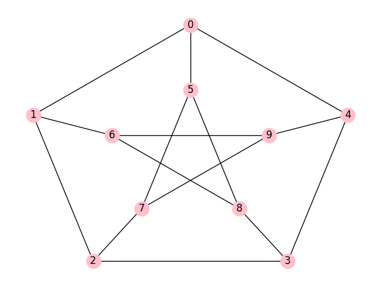

# Spanning trees search

This library supports computation and visualisation of spanning trees. 
- `SpanningTrees()` 
    - Class supporting any [NetworkX](https://networkx.org/) graph input with custom positioning
    - Fast matrix computation of the number of spanning trees via [Kirchoff's theorem](https://en.wikipedia.org/wiki/Kirchhoff%27s_theorem?oldformat=true)
    - Custom recursive spanning tree search algorithm: outputs spanning trees as NetworkX objects (more info in [Algorithm description]() below)
    - Export and visualisation (as images, adjacency matrix files or gif animation)
- `GraphMatrix()`
    -  Class for flexible handling between multiple matrix representations of graphs: in particular, conversion between indidence matrices, adjacency matrices, degree and laplacian matrices.

> In the mathematical field of graph theory, a **spanning tree** T of an undirected graph G is a **subgraph** that is a tree which **includes all of the vertices of G.** In general, a graph may have several spanning trees, but a graph that is not connected will not contain a spanning tree (see spanning forests below). [Wikipedia – Spanning tree](https://en.wikipedia.org/wiki/Spanning_tree?oldformat=true)

## Example: Spanning trees of Petersen Graph
- [Petersen graph](https://en.wikipedia.org/wiki/Petersen_graph?oldformat=true) is an undirected graph with 10 vertices and 15 edges.
- It has 2000 spanning trees. 
- See gif animation (visualised using code in this repository) below.
- More info in [demo_petesen_graph.ipynb](demo_petesen_graph.ipynb)




## Usage
- command-line-interface usage is described below
- for Reading and exporting files see [demo_read_export.ipynb](demo_read_export.ipynb)
- for more examples see [demo_visualisation.ipynb](demo_visualisation.ipynb)

### **Installation**
- (Optional): Create virtual environment
- Install requirements via pip

`pip install -r requirements.txt`

### **CLI**

`cli.py --graph-adjacency tests/saving/k4_adjacency.csv --count`
```
1) Adjacency matrix loaded.
2) Remaining matrices computed.
Number of spanning trees:  16
```

`cli.py --graph-incidence tests/saving/k4_incidence.csv --trees --gif --output tests/k4_run_cli`
```
1) Incidence matrix loaded.
2) Remaining matrices computed.
Number of spanning trees:  16
Everyting is saved in  tests/k4_run_cli
```

`cli.py`
```
usage: cli.py [-h] (--graph-adjacency GRAPH_ADJACENCY | --graph-incidence GRAPH_INCIDENCE) [--output OUTPUT] [--gif] [--count] [--trees]

Spanning Trees Search 
    A library for spanning tree computation 
    - one of the arguments --graph-adjacency --graph-incidence is required 
    - argument --graph-incidence: not allowed with argument --graph-adjacency 
    
    Example usage:

optional arguments:
  -h, --help            show this help message and exit
  --graph-adjacency GRAPH_ADJACENCY
                        Graph to be loaded in adjacency matrix format in .csv
  --graph-incidence GRAPH_INCIDENCE
                        Graph to be loaded in incidence matrix format in .csv
  --output OUTPUT       Directory where all files will be saved
  --gif                 Gif export
  --count               Count the number of spanning trees
  --trees               Find spanning trees
```
### **Python**

Creating adjacency matrix via numpy:
```python
k4_adjacency = np.ones((4, 4)) - np.diag(np.ones(4))
k4_adjacency = k4_adjacency.astype(np.int32)
print("Adjacency matrix of K4 fully connected graph")
print(k4_adjacency)
```
Output:
```
Adjacency matrix of K4 fully connected graph
[[0 1 1 1]
 [1 0 1 1]
 [1 1 0 1]
 [1 1 1 0]]
```
Computing remaining matrices:
```python
k4_graphmatrix = GraphMatrix()
k4_graphmatrix.adjacency_matrix = k4_adjacency 
k4_graphmatrix.compute_remaining_matrices()
```
Getting the number of spanning trees via Kirchoff`s theorem:
```python
print("Number of spanning trees")
print(k4_graphmatrix.adjugate_subdeterminant)
```
Output:
```
Number of spanning trees
16
```
Computing spanning trees:
```python
trees = SpanningTrees(k4_graphmatrix.graph)
trees.compute_spanning_trees(visualisation='plots_inline')
# outputs visualisation of each spanning tree
```
Exporting spanning trees:
```
trees.export_spanning_trees(save_path="tests/k4_run")
trees.export_gif()
```
Outputs folder structure like this:
- `graph.png`: image of original graph
- `graph_adjacency.csv`: adjacency matrix csv of original graph
- `spanning_tree.gif`: gif animation of spanning trees
- `csv_output`: folder with adjacency matrices of spanning trees
- `images`: folder with images matrices of spanning trees
```
├── run
    │── graph.png
    │── graph_adjacency.csv
    │── spanning_tree.gif
    │── csv_output
    │   ├── spanning_tree_adjacency_001.csv
    │   ├── spanning_tree_adjacency_002.csv
    │   └── spanning_tree_adjacency_003.csv
    └── images
        ├── spanning_tree_001.png
        ├── spanning_tree_002.png
        └── spanning_tree_003.png
```

## Algorithm description

### Compute number of trees via Kirchoff's theorem
- source: `GraphMatrix.compute_remaining_matrices()`

1. Adjacency and degree matrix is obtained:
- `GraphMatrix.incidence2adjacency()`: If there is and incidence matrix in the input, convert incedence matrix to adjacency 
- `GraphMatrix.degree_matrix()`: Obtain degree matrix
2. `GraphMatrix.laplacian_matrix()`: Compute laplacian matrix as a difference of matrices above `degree_matrix - adjacency_matrix`
3. `GraphMatrix.laplacian_adjugate_matrix()`: Compute laplacian adjugate matrix
4. `GraphMatrix.adjugate_subdeterminant` stores number of spanning trees

### Recursively searching and visualising spanning trees
- source: `SpanningTrees.process()`

Spanning tree is induced subgraph of the given graph, that is connected and has no cycles, therefore being a tree.

**Pseudocode**
- Function works as binary tree, where each node is an induced subgraph and in each level we are selecting and removing one edge. 
- Leaves of the tree are possible spanning trees (where every possible edge was removed)
- We are using recursion and passing fixed edges and number of iteration
1. In every iteration we are choosing edge for removal and fixation with following conditions:
    1. edge should be new (not previously chosen)
    2. its removal should not affect connectedness
    3. its fixation should not create cycle of fixed edges
2. Then we are fixing the edge (creating left children) and removing it from the graph (creating right children)
3. In next iteration we repeat the same procedure for left and right children, until we reach the leaves of the tree.

**Complexity**
Algorithm has time and memory complexity O(2^n) which is maximum number of spanning trees in fully connected graphs.

**Showcase**
Showcase and explanation is in attached jupyter notebooks. Algorithm was tested on fully-connected graph K4, erdös-renyi random graphs and petersen_graph (ranging from 16 to 2000 spanning trees).

### Structure of this repository

```
├── README.md
├── assets
│   ├── example_gif.gif
│   ├── example_graph.png
│   ├── petersen.gif
│   └── petersen.png
├── cli.py
├── demo_petersen_graph.ipynb
├── demo_read_export.ipynb
├── demo_visualisation.ipynb
├── requirements.txt
├── spanning_trees_search
│   ├── GraphMatrix.py
│   ├── SpanningTrees.py
│   ├── __init__.py
└── tests
    ├── k4_run
    │   ├── csv_output
    │   │   ├── spanning_tree_adjacency_000.csv
    │   │   ├── spanning_tree_adjacency_001.csv
    │   │   ├── spanning_tree_adjacency_002.csv
    │   ├── graph.png
    │   ├── graph_adjacency.csv
    │   ├── images
    │   │   ├── spanning_tree_000.png
    │   │   ├── spanning_tree_001.png
    │   │   ├── spanning_tree_002.png
    │   └── spanning_tree.gif
    ├── k4_run_cli
    │   ├── csv_output
    │   │   ├── spanning_tree_adjacency_000.csv
    │   │   ├── spanning_tree_adjacency_001.csv
    │   │   ├── spanning_tree_adjacency_002.csv
    │   ├── graph.png
    │   ├── graph_adjacency.csv
    │   ├── images
    │   │   ├── spanning_tree_000.png
    │   │   ├── spanning_tree_001.png
    │   │   ├── spanning_tree_002.png
    │   └── spanning_tree.gif
    ├── petersen_run
    │   ├── csv_output
    │   │   ├── spanning_tree_adjacency_000.csv
    │   │   ├── spanning_tree_adjacency_001.csv
    │   │   ├── spanning_tree_adjacency_002.csv
    │   ├── graph.png
    │   ├── graph_adjacency.csv
    │   ├── images
    │   │   ├── spanning_tree_000.png
    │   │   ├── spanning_tree_001.png
    │   │   ├── spanning_tree_002.png
    │   └── spanning_tree.gif
    └── saving
        ├── k4_adjacency.csv
        ├── k4_adjacency_graphmatrix.csv
        ├── k4_adjacency_graphmatrix.png
        └── k4_incidence.csv
```

## Future updates
- Algorithm is implemented from scratch and for visualisation purposes, thus could be better optimized.
- Comparison with Kruskal's, Borůvka's and other algorithms could be made.
- Interesting would be to visualise how what are intermediate determinant computations in Kirchoff's theorem doing as they reach the real number of spanning trees. 


## Disclaimer
This repository came into being as a school homework ("zápočtový program" at Charles university Programming I course) and implements the main algorithm and matrix computations from scratch: it not intended nor optimized enough for industrial applications.